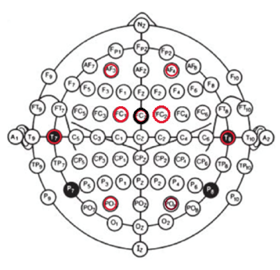
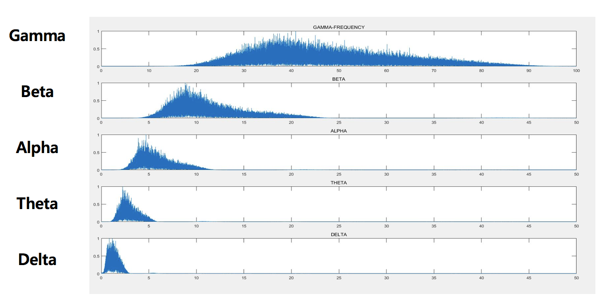
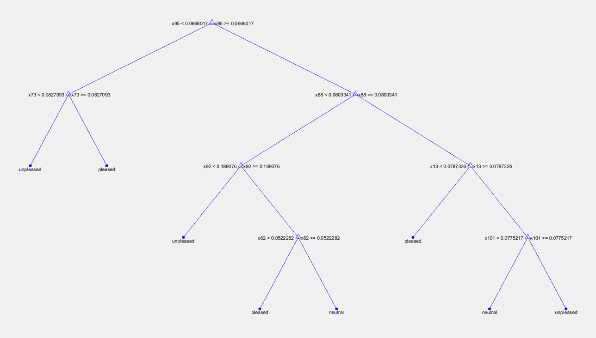

# EEG_Emotion_Classfication

## Overview
EEG_Emotion_Classification은 pleasure, neutral, unpleasure 감정을 의도한 영상을 보면서 사람의 뇌파(EEG)를 통해 얻어진 머리의 특정 부위들의 Feature 데이터를 추출하고 해당 데이터를 사용하여 의사 분류 트리에 해당 데이터들을 입력하고 감정 분류를 실시하는 모듈이다.적절한 뇌파 추출을 위해 EEG 측정 Device를 사용하여 남자 10명, 여자 10명의 데이터를 추출하였으며, 실험 과정 중 잘못된 실험 프로토콜 설정으로 인한 결과물을 제외한 총 10가지의 데이터를 수집하였다.

## Features
Data 폴더에 위치한 데이터들은 .mat 파일의 확장자를 가지고 있으며 피실험자는 총 18개의 영상을 시청하고 다음 영상을 방해하는 노이즈를 최대한 줄이기 위해 30초씩 휴식을 취한다. 데이터는 2x18의 셀로 이루어져 있으며 1행은 영상을 보면서 추출된 데이터이고, 2행은 30초마다의 휴식 기간의 데이터이다. 각 열은 서로 다른 18개의 영상을 나타낸 것이다.

 

셀 하나를 클릭하면 다음과 같이 영상을 보고 실시간으로 측정된 데이터들을 확인할 수 있으며 행의 개수는 시간의 흐름 (1초당 1000개)을 나타낸다.
각 열은 다음과 같다.
  1 = ECG  
2 = EMG  
3 = SWITCH  
4-11 = EEG 8개 단자  
12-13 = 피 실험자의 SAM TEST 결과  
 

## EEG 8개 단자
AF3 / AF4 – 인지, 감성, 정신적 기능을 담당하는 전두엽 
T7/ T8 – 청각을 담당하는 측두엽 
PO3 / PO4 – 시각을 담당하는 후두엽 
FC1 / FC2  
 

## Data Organization and trim some noise
matlab 내의 Wavelet Analyser 앱을 이용하여 파워스펙트럼 분석 실시한다.
<pre><code>
waveletFunction = 'db8';
                [C,L] = wavedec(s,8,waveletFunction);
       
                cD1 = detcoef(C,L,1);
                cD2 = detcoef(C,L,2);
                cD3 = detcoef(C,L,3);
                cD4 = detcoef(C,L,4);
                cD5 = detcoef(C,L,5); %GAMA
                cD6 = detcoef(C,L,6); %BETA
                cD7 = detcoef(C,L,7); %ALPHA
                cD8 = detcoef(C,L,8); %THETA
                cA8 = appcoef(C,L,waveletFunction,8); %DELTA
                D1 = wrcoef('d',C,L,waveletFunction,1);
                D2 = wrcoef('d',C,L,waveletFunction,2);
                D3 = wrcoef('d',C,L,waveletFunction,3);
                D4 = wrcoef('d',C,L,waveletFunction,4);
                D5 = wrcoef('d',C,L,waveletFunction,5); %GAMMA
                D6 = wrcoef('d',C,L,waveletFunction,6); %BETA
                D7 = wrcoef('d',C,L,waveletFunction,7); %ALPHA
                D8 = wrcoef('d',C,L,waveletFunction,8); %THETA
                A8 = wrcoef('a',C,L,waveletFunction,8); %DELTA
                
                Gamma = D5;
                %figure; subplot(5,1,1); plot(1:1:length(Gamma),Gamma);title('GAMMA');
               
                Beta = D6;
                %subplot(5,1,2); plot(1:1:length(Beta), Beta); title('BETA');
                
                Alpha = D7;
                %subplot(5,1,3); plot(1:1:length(Alpha),Alpha); title('ALPHA'); 
                
                Theta = D8;
                %subplot(5,1,4); plot(1:1:length(Theta),Theta);title('THETA');
                D8 = detrend(D8,0);
                
                 Delta = A8;
                %figure, plot(0:1/fs:1,Delta);
                %subplot(5,1,5);plot(1:1:length(Delta),Delta);title('DELTA');
</code></pre>

파워스펙트럼(푸리에 변환)을 이용하여 노이즈 제거 후 뇌파의 종류별로 데이터 재검출 
Delta : 0 ~ 4Hz 
Theta: 4 ~ 8Hz 
Alpha: 8 ~ 12Hz 
Beta: 12 ~ 30Hz 
Gamma: 30 ~ 50Hz 

## Conclusion Using Decision Tree
•  In the case of EMG data, it can be confirmed that the signal is large when 'pleasant' and the signal is small when 'unpleasant'. 
• 86% for pleasure images, 88% for unpleasure images, and 70% for neutral images. 
• EEG signal data from 10 people showed 82% emotion classification 
• Combination with other signals such as ECG and EMG will give you a higher level of accuracy. 

